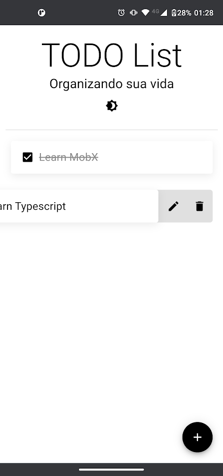
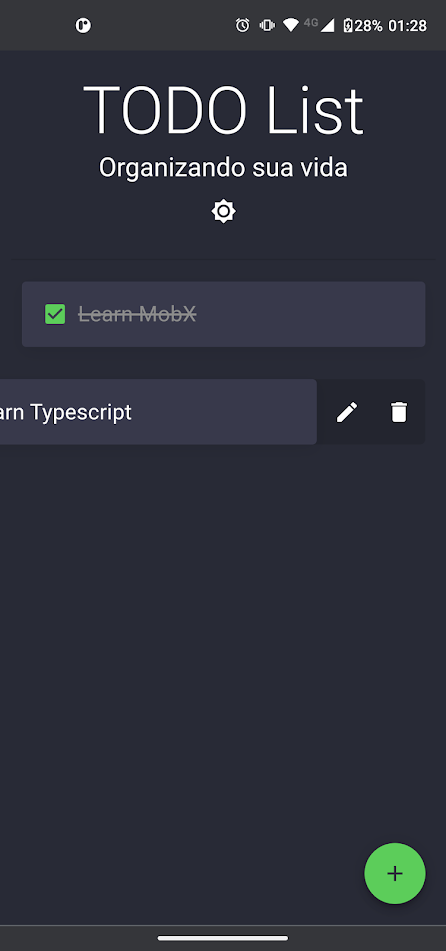
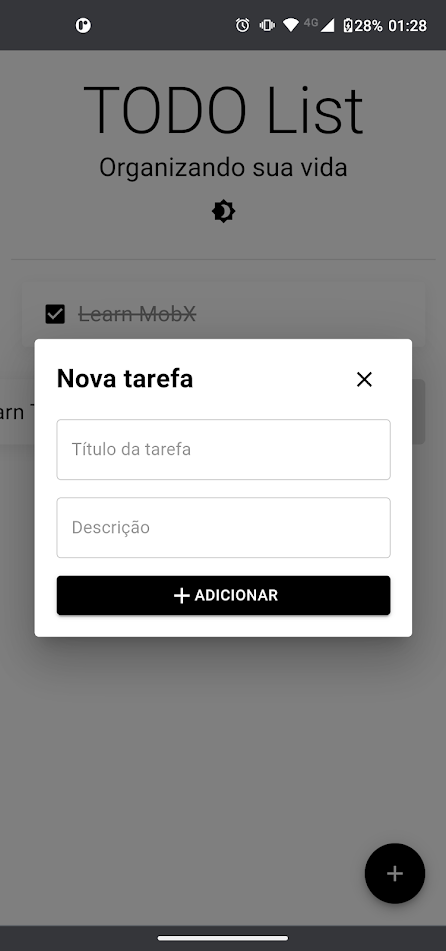

# Just another TODO List

## About

- This is a project created to teach some concepts and ways to make a simple TODO app with strategies like localStorage sync, web gestures and the distribution of PWA with React.

## Tech and Tools

- ReactJS
- Material-UI as Components and Theme Provider
- Typescript
- React Gesture Handler
- MobX

## Preview

